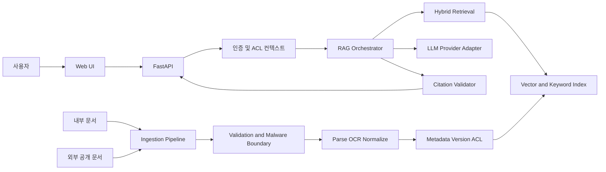

# Architecture

## 설계 원칙

- API-first: UI와 외부 소비자는 동일한 API 계약을 사용합니다.
- Provider-neutral: LLM, 임베딩, 검색 저장소는 어댑터로 교체합니다.
- ACL-first: 문서 권한을 수집부터 검색과 인용까지 유지합니다.
- Evidence-first: 답변보다 근거 검색과 인용 검증을 먼저 설계합니다.
- Evaluation-driven: 청킹/검색/모델 변경은 고정 평가셋으로 비교합니다.

## 전체 흐름

## 수집 파이프라인

1. Source adapter가 파일, 승인된 URL, API에서 문서를 가져옵니다.
2. 크기/MIME/도메인/중복을 검사하고 위험한 입력을 격리합니다.
3. 파서/OCR이 텍스트와 표 구조, 페이지 위치를 추출합니다.
4. 정규화 단계가 문서 ID, 버전, ACL, content hash를 부여합니다.
5. 주제별 chunker가 의미 단위를 만들고 검색 인덱스에 저장합니다.
6. 처리 결과와 실패 이유를 남겨 재처리할 수 있게 합니다.

## 질의 파이프라인

1. API가 인증 정보와 사용자 질문을 검증합니다.
2. 정책 계층이 tenant와 허용 ACL을 SearchContext로 만듭니다.
3. 검색기가 ACL 필터와 함께 후보 청크를 찾습니다.
4. 재정렬기가 질문과 근거 관련도를 다시 계산합니다.
5. 오케스트레이터가 문서 내 악성 지시를 데이터로 구분해 컨텍스트를 조립합니다.
6. 생성기가 근거 안에서만 답하고 인용 식별자를 반환합니다.
7. 인용 검증기가 문장-근거 정합성과 권한을 확인합니다.
8. 근거가 부족하면 답변을 보류하고 필요한 문서를 안내합니다.

## 계획 API

| Method | Path | 목적 |
|---|---|---|
| GET | `/api/v1/health` | 프로세스 상태 |
| POST | `/api/v1/documents` | 승인된 문서 등록 |
| GET | `/api/v1/documents/{id}` | 처리 상태와 메타데이터 |
| DELETE | `/api/v1/documents/{id}` | 원본 및 파생 데이터 삭제 |
| POST | `/api/v1/query` | 근거 기반 질의응답 |
| POST | `/api/v1/feedback` | 답변/인용 피드백 |
| GET | `/api/v1/admin/evaluations` | 평가 실행 결과 |

현재 구현된 API는 health와 주제 미선정 상태의 query 계약뿐입니다.

## 주제 선정 후 결정할 항목

- 문서 형식과 OCR 필요성
- 인증 방식과 ACL 모델
- 키워드/벡터/하이브리드 검색 조합
- 로컬 또는 관리형 저장소
- LLM/임베딩 공급자와 데이터 보존 정책
- 동기 처리 또는 작업 큐
- 웹 프레임워크와 배포 플랫폼

